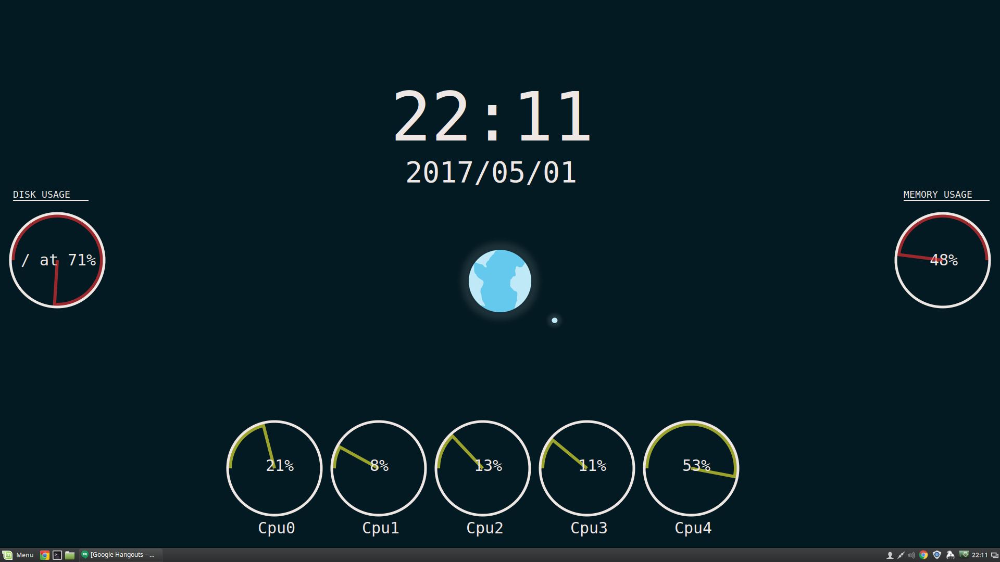

# conky-lua
Minimilist conky monitoring script

## Preview
### 4 or less cores


### 8 cores


## Installing
### via git

```bash
git clone git@github.com:ThatJames/conky-lua.git ~/.conky-lua

~/.conky-lua/start.sh
```
### via zip
```bash
unzip conky-lua.zip -d ~/.conky-lua

~/.conky-lua/start.sh
```

### Dependencies
Requires `lua` and the `cairo` lib
